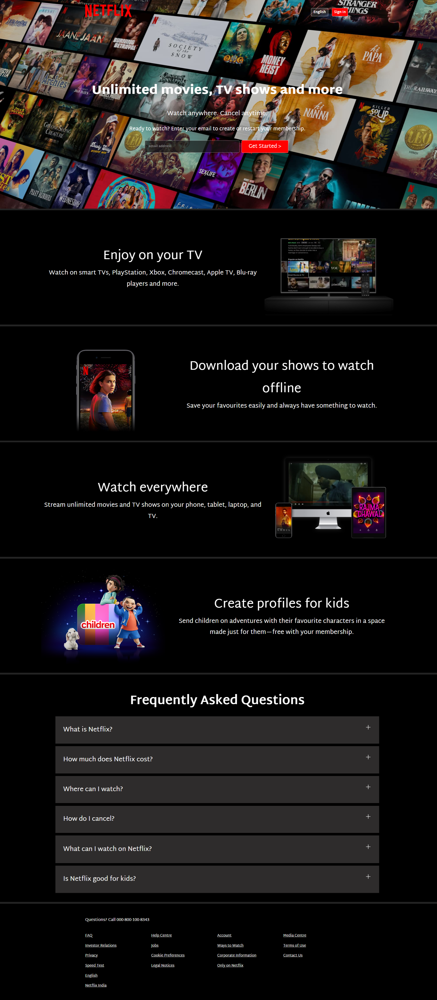

# Netflix Clone – HTML & CSS Only

A responsive clone of Netflix's landing page built using pure HTML and CSS. This project replicates the front-end design of Netflix to showcase UI structuring, responsive layouts, and modern styling using Flexbox and CSS Grid.

---

## 📑 Table of Contents

- [Preview](#preview)
- [Features](#features)
- [Technologies Used](#technologies-used)
- [Usage](#usage)
- [Deployment](#deployment)
- [Contact](#contact)
- [Acknowledgments](#acknowledgments)

---

## 🔍 Preview

  
*Homepage: Featuring Netflix banner and sign-in form.*

---

## 🌟 Features

- 🎬 Clean Netflix-inspired landing page UI
- 📱 Fully responsive design (mobile to desktop)
- 🧰 Built using semantic HTML and modular CSS
- 🎨 CSS-only design: No JavaScript involved

---

## 🛠️ Technologies Used

- **HTML5**
- **CSS3** (Flexbox, Grid, Media Queries)
- **Google Fonts & Icons**

---

## 🚀 Usage

You can either download the project or clone the repository:

```bash
git clone https://github.com/RohanBhoge/netflix_clone.git
